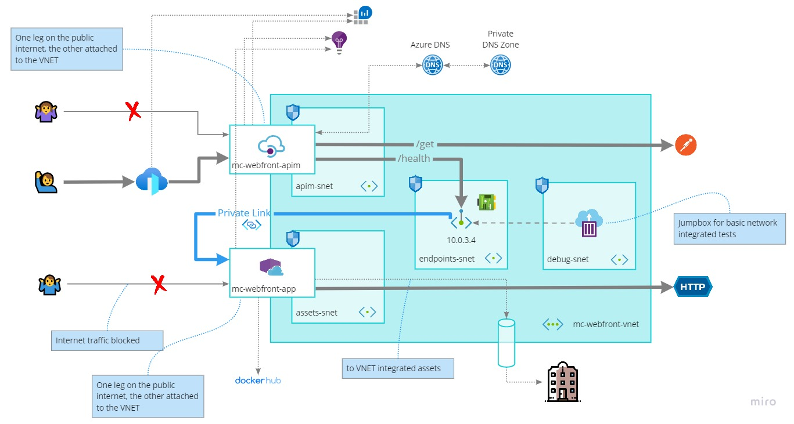
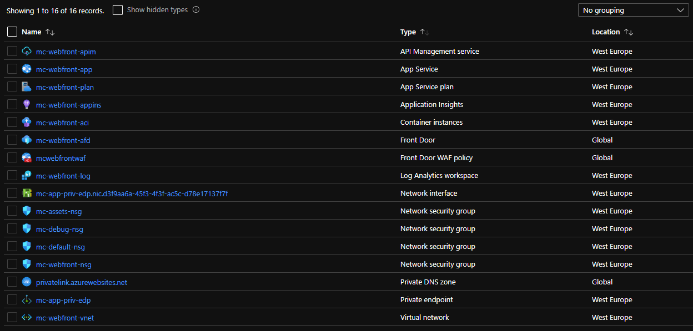
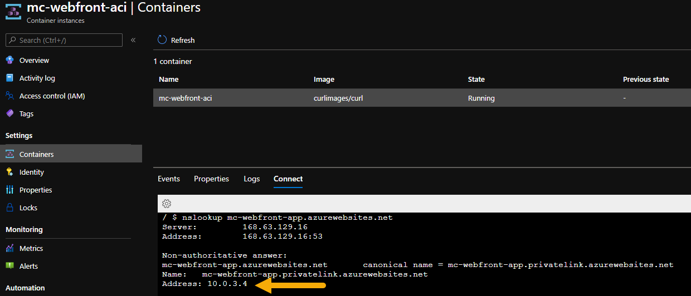
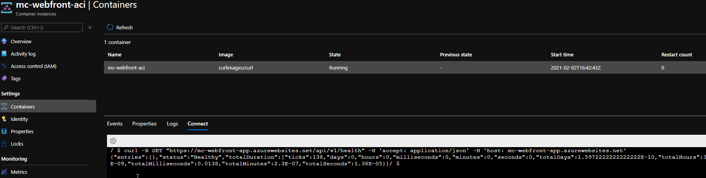
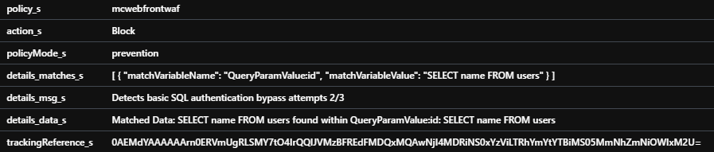
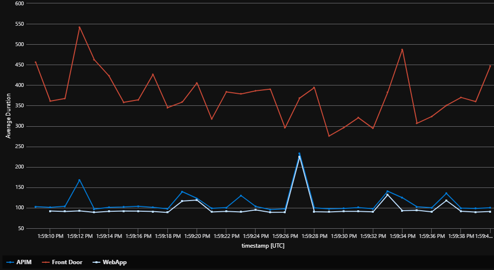

# Introduction
Starting from the sample of Paolo Salvatori https://github.com/paolosalvatori/front-door-apim this exercise introduces few additional objects:
- A simple API running on App Service (Web App for containers).
    - Linux plan, pull image from GitHub, forward requests to external API, Application Insights integration.
- Private Link 
    - Azure Private Link allows you to privately access to services hosted on the Azure platform without requiring internet connection (via Azure backbone network). 
    - https://docs.microsoft.com/en-us/azure/private-link/private-link-service-overview
- App Service Private Endpoint (Private IP to secure inbound traffic)
    - Available in Premium v2 and v3 https://docs.microsoft.com/en-us/azure/app-service/networking/private-endpoint
- App Service regional VNET integration (secure outbound traffic)
    - To have all inbound and outbound traffic in the VNET, we need to use both Private Endpoint and Regional VNet Integration in two separate subnets. 
- ACI VNET integration used as basic jumpbox (via azure portal)
- APIM Backends
- APIM Global policy for tracing
- APIM SubscriptionKey creation

# Architecture


 

# Deployment
- Edit the ARM template parameter file in the folder azuredeploy.parameters.json for a customized deployment
- Edit the bash script in the "scripts" folder to specify the target subscription-id and the resource-group.
- Run the deploy.sh command to deploy the sample.



# Testing

Private endpoint DNS resolution


Test internal endpoint



To postman echo backend
```
curl --location --request GET 'https://mc-webfront-afd.azurefd.net/front-echo/get' \
--header 'Ocp-Apim-Subscription-Key: super-secure' \
--header 'Content-Type: application/json' 
```

To Web.Api health
```
curl --location --request GET 'https://mc-webfront-afd.azurefd.net/front-echo/health' \
--header 'Ocp-Apim-Subscription-Key: super-secure' \
--header 'Content-Type: application/json' 
```

To Web.Api health and forwarded to external dependency
```
curl --location --request GET 'https://mc-webfront-afd.azurefd.net/front-echo/health?type=1' \
--header 'Ocp-Apim-Subscription-Key: super-secure' \
--header 'Content-Type: application/json' 
```

Global policy error management
```
curl --location --request GET 'https://mc-webfront-afd.azurefd.net/front-echo/health?type=1error' \
--header 'Ocp-Apim-Subscription-Key: super-secure' \
--header 'Content-Type: application/json' 
```

Block SQL injection
```
curl --location --request GET 'https://mc-webfront-afd.azurefd.net/front-echo/health?id=SELECT+name+FROM+users' \
--header 'Ocp-Apim-Trace: true' \
--header 'Ocp-Apim-Subscription-Key: super-secure' 
```

LogAnalytics query (AFD firewall log)
```
AzureDiagnostics
| where ResourceType == "FRONTDOORS" and Category == "FrontdoorWebApplicationFirewallLog"
and trackingReference_s == "0AEMdYAAAAAArn0ERVmUgRLSMY7tO4IrQQlJVMzBFREdFMDQxMQAwNjI4MDRiNS0xYzViLTRhYmYtYTBiMS05MmNhZmNiOWIxM2U="
```



LogAnalytics (simple queries)
```
AzureDiagnostics
| where Category == "FrontdoorAccessLog" 
and userAgent_s  == "PostmanRuntime/7.26.8"
and TimeGenerated between (datetime("2021-01-22 11:58:00") .. datetime('2021-01-22 15:20:00'))
and requestUri_s contains "health"
| order by TimeGenerated desc 


AzureDiagnostics
| where ResourceProvider == "MICROSOFT.APIMANAGEMENT"
and TimeGenerated between (datetime("2021-01-22 11:58:00") .. datetime('2021-01-22 15:20:00'))
and url_s contains "health"
| order by TimeGenerated desc 

```

Request duration

Request duration in AFT, Api Management and Web App for containers in the last 10 minutes.



Query
```
let startDatetime = now(-10m);
let endDatetime = now();
let interval = 1s;
AzureDiagnostics
| where Resource == 'MC-WEBFRONT-AFD'
  and TimeGenerated  between(startDatetime .. endDatetime)
| extend duration = toreal(timeTaken_s) * 1000,
         service = "Front Door",
         timestamp = TimeGenerated
| project service, duration, timestamp

| union (app("MC-WEBFRONT-APPINS").requests
| where url contains "-apim."  
  and name != "GET /"
  and timestamp between(startDatetime .. endDatetime)
| extend service = "APIM"
| project service, duration, timestamp)


| union (app("MC-WEBFRONT-APPINS").requests
| where url contains "-app."  
  and name != "GET /"
  and timestamp between(startDatetime .. endDatetime)
| extend service = "WebApp"
| project service, duration, timestamp)

| summarize ['Average Duration'] = avg(duration) by bin(timestamp, interval), service
| render timechart 
```

AFD configured with prevention mode


# Notes
- Private Link with Azure DNS https://docs.microsoft.com/en-us/azure/private-link/private-endpoint-dns#virtual-network-workloads-without-custom-dns-server

- Subresources to be used as groupIds can be found here: https://docs.microsoft.com/en-us/azure/private-link/private-endpoint-overview#private-link-resource

- DNS configuration for ACI can be added by put the following json in the properties of "Microsoft.ContainerInstance/containerGroups"
```
"dnsConfig": {
    "nameServers": [ "192.168.0.150", "192.168.8.150"],
    "options": "ndots:2"
}
```